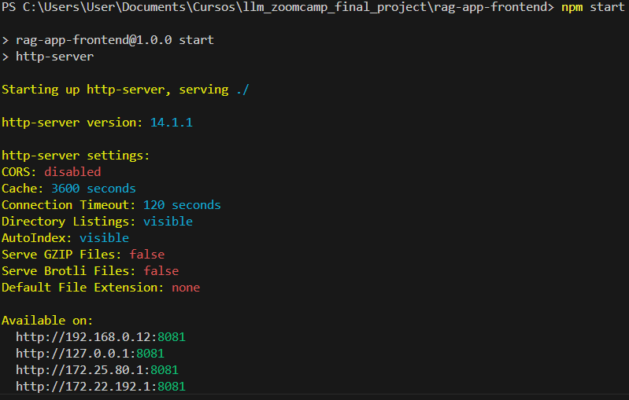

# DocuMentor: Academic Papers Assistant


Academic research and writing can be incredibly challenging, especially for young students. Reading through countless papers and recalling specific details later during the writing process can be arduous.

DocuMentor is here to make your academic journey easier! It can answer questions about your articles, making it simple to find the information you need. It's also a fantastic tool to help you understand new concepts.

This project was implemented as part of the [Zoomcamp](https://github.com/DataTalksClub/llm-zoomcamp) - a free course about LLMs and RAG.


## Project Overview

DocuMentor is an assistant for reading papers, designed to help students, researchers, or any other users in reading academic papers and understanding concepts.

The main use cases are:

1. Getting general information about the papers.
2. Quickly checking for key concepts: Asking whether or not some concepts are included within the knowledge database.
3. Solving questions about the topics covered in the knowledge database.

## Project Content

Here is a short explanation of the content of the project's files and directories:

* credentials: This directory should be used for saving the GCP user credentials to run the SDKs. This is generated using `gcloud auth application-default login` (see Makefile). The credentials created are expected to be saved to a file called `credentials.json` within this directory (as can be seen in the `docker-compose.yaml`, they are passed as volumes to the container).
* data: Different results coming from the testing process to create the RAG are saved within this file. Exploring the notebooks can make it clearer what to find here.
* docs: The knowledge database used for the creation of the process that is uploaded to GCS. More documents can be added, as well as more categories created, but keep in mind that the frontend is not updated dynamically with the folders, so if another one is added, you will have to change the options as well.
* images: Images used in the readme.
* notebooks: The notebooks containing the logic used in creating the different modules that finally integrate the RAG, as well as all the experiments and tests.
* rag-app-frontend: The code for the RAG’s front end built in Node.js.
* src: The code for the RAG, as well as all the definitions used in the notebooks.
* tests: Directory for unit testing. Used only for some self-defined functions for chunking. All elements of this project should include tests within this directory until a minimum coverage is achieved for a production case scenario.
* .gitignore: Definition of files not to be tracked.
* docker-compose.yaml: File containing the instructions to deploy all services that are part of this project.
* dockerfile: Dockerfile to create the RAG's app image.
* makefile: File defining some commands to run this project.
* requirements.txt: File with all the dependencies to be installed for the RAG to function.

## Dataset

The dataset used in this project consists of 22 papers divided into 3 categories:

* deeplearning
* statistics
* time_series

The documents are within docs/.

## Data Chunking

Since the documents are PDFs with complex structure, an adequate chunking process was needed. The notebook "create_preprocessors" explores the creation of several processing functions to chunk the data considering the options:

* Sentence splitting: Simply using characters to split the PDF's text into sentences.
* Propositional splitting: Using an LLM to create propositions out of the sentences.
* Semantic Chunking: Encoding the sentences with an embedding model and then creating the chunks as groups minimizing the distance between groups of sentences in the vectorial space.
* Sequential Semantic Chunking: A similar logic but respecting the order of the sentences.

In the `src/preprocess.py` module can be found the results of this exercise. Using these classes, the "chunking_searching_evaluation" notebook explores the best alternatives for the searching algorithm in each case and the "rag_evaluation" notebook compares the best scenarios for each algorithm to select the chunking process to be used in the RAG.

## Technologies

* Python 3.12
* Node.js 18
* Docker and Docker Compose for containerization
* Minsearch for full-text search
* Hybsearch for hybrid search
* Elasticsearch as vector db
* GCP storage for documents saving in the cloud
* Flask as the API interface (see Background for more information on Flask)
* Grafana for monitoring and PostgreSQL as the backend for it
* Gemini as LLM

## Preparation

This project was designed using a Gmail account and a 3-month trial in GCP. Therefore, some GCP resources are expected to be used. The first steps to follow are:

1. Create (optional) and get the ID of a GCP project.
2. Enable the generative AI API.
3. Get a Google API KEY.
4. Create a Cloud Storage bucket.
5. Get application default credentials (see Makefile) and store the credentials within the credentials directory as "credentials.json".

After all the previous steps have been achieved, create a ".env" at the same level as the docker-compose.yaml with the information:

```
# LLM key
GOOGLE_API_KEY=YOUR KEY

# GCS vars
GCP_PROJECT_ID=YOUR PROJECT
BUCKET=YOUR BUCKET

# Elasticsearch vars
INDEX_NAME=documentor_project
TEXT_FIELDS=category,paper,text
KEYWORD_FIELDS=id
ELASTICSEARCH_HOST=elasticsearch
ELASTICSEARCH_PORT=9200
EMBEDDING_MODEL=all-mpnet-base-v2

# Nodes for parallel processing
WORKERS=6 MAKE IT SMALLER IF YOU DON'T HAVE ENOUGH CORES IN YOUR COMPUTER

# App config
APP_HOST=0.0.0.0
APP_PORT=5000

# PostgreSQL Configuration
POSTGRES_HOST=postgres
POSTGRES_DB=documentor
POSTGRES_USER=YOUR USER
POSTGRES_PASSWORD=YOUR PASS
POSTGRES_PORT=5432

# Grafana Configuration
GRAFANA_ADMIN_USER=admin
GRAFANA_ADMIN_PASSWORD=YOUR PASS
GRAFANA_SECRET_KEY=SECRET_KEY

# Timezone
TZ=America/Bogota
```

Create a Python virtual environment and install the dependencies. In Windows, you could run:

```
python -m venv environment_name
environment_name/Scripts/activate
pip install -r requirements.txt
```

## Running the Application

### Database Configuration

Before the application starts for the first time, we need to configure our databases, which in this case consists of three steps:

* Loading our documents to GCS (This is a step designed to orient the process to a cloud architecture and a future development of indexation based on triggers whenever a new document is uploaded).
* Chunking and Indexing the documents to the vector DB. This process can take UP TO 6 HOURS.
* Preparing the PostgreSQL DB.

For this, we run:

```
docker-compose up postgres

python src/initialize.py
```

In the notebook "test_app.ipynb" there is a section for consulting the PostgreSQL DB to check whether the app is adequately updating the data. This can also be used to check that the tables were created:


### Running with Docker Compose

```
docker-compose up
```

## Using the Application

A simple interface was created using Node.js to simplify the interaction with the app. To run it, run in cmd:

```
cd rag-app-frontend
npm start
```



By following the endpoint, we should get:


Where we can both make questions and give feedback.

## Code

The code for the application is in the src folder and includes:

* app - The Flask API, the main entry point to the RAG's app.
* data_ingestion - A module defining classes and functions for the data ingestion to the vector db.
* db - A module with general utilities for the databases handling.
* evaluation - Module with definitions for search algorithms and RAG's evaluation.
* hybsearch - An in-memory hybrid search engine.
* initialize - Module containing all the definitions for the app initialization.
* minsearch - An in-memory search engine.
* optimization - A module with definitions for hyperparameters tuning.
* preprocess - A module with all the definitions for the documents preprocessing.
* rag - Module defining the architecture for the RAG itself.
* storage - Utilities to handle GCS.

## Experiments

In order to run the experiments, the requirements.txt file within the notebooks directory should be used for dependencies installation. We have the following notebooks:

* create_preprocessors - Notebook containing the design of the chunking algorithms.
* ground_truth_data_generation - Notebook containing the generation of the data to test the different algorithms.
* chunking_searching_evaluation - Notebook containing the evaluation of the different search algorithms and the optimization of hyperparameters.
* rag_evaluation - Notebook where the different chunking algorithms are compared and finally the best strategy is selected and the full RAG is evaluated.
* db_initialization - Notebook used to test the DB initialization process.
* test_app - Notebook used to test the app's endpoint and the information saving process to PostgreSQL.

## Retrieval Evaluation

The selected alternative at the end was:

* Sequential semantic chunking.
* Vector search using Elasticsearch.

which achieved:

* Hit rate: 79%
* MMR: 45%

Using the parameters:

```
{
    "num_results": 20,
    "boost_dict": {
        "category": 0.08962309625236509,
        "paper": 1.5419571656285616,
        "text": 1.0558143115463618
    },
    "alpha": 1
}
```

## RAG Flow Evaluation

The following results were achieved when comparing the relevance across different numbers of documents being retrieved:


## Monitoring

We use Grafana for monitoring the application, accessible at localhost:3000 with the login and password defined in the .env file.

The dashboard is to be implemented by each final user. As an example, the following one was created for this project:


## Acknowledgements

I want to thank all the people behind the [Zoomcamp](https://github.com/DataTalksClub/llm-zoomcamp) for sharing their knowledge, especially Alexey Grigorev.